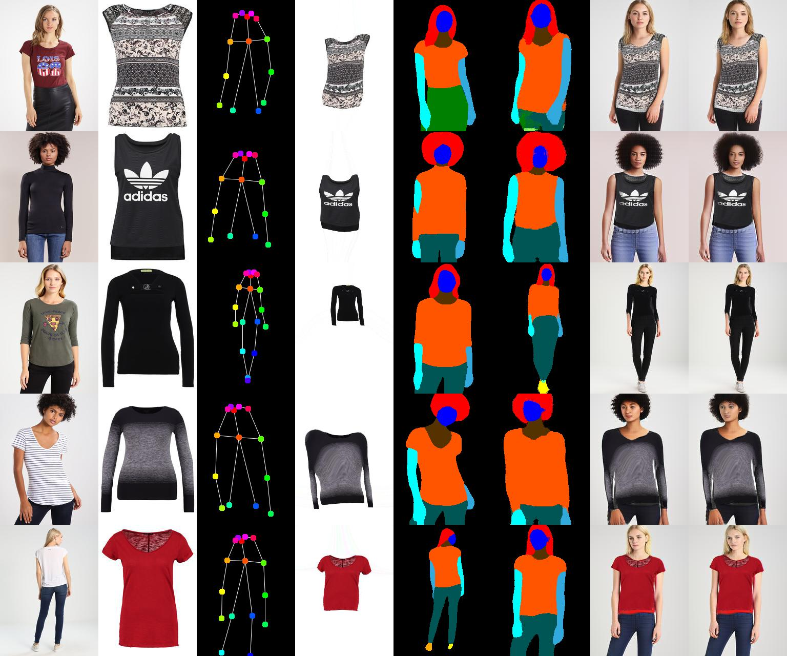

# Detailed Vitural Try-on
Code for Detailed virtual try-on under arbitrary poses.



# Requirements
* Pytorch(0.4.1)
* Torchvision(0.2.1)
* pillow
* tqdm
* numpy
* json
* Tensorflow

# Getting Started 
## Installation
* Clone this repo
```
git clone https://github.com/AIprogrammer/Detailed-virtual-try-on.git. 
cd Detailed-virtual-try-on
```
* Download pretrained models from [Google Drive](https://drive.google.com/open?id=1vQo4xNGdYe2uAtur0mDlHY7W2ZR3shWT). Put the checkpoints in "./pretrained_checkpoint". 

## Demo 
* A demo model is given, and we provide some samples in "./dataset/images". The triplets including source image, target pose, target cloth is provided in the "./demo/demo.txt".
* Quick testing and check the result in "./demo/forward/0.jpg"
```
sh demo.sh
```

# Training

## Download the dataset
* Download the MPV dataset from [Image-based Multi-pose Virtual Try On](http://47.100.21.47:9999/overview.php) and put the dataset in "./dataset/images/".
* Select the postive perspective images and create dataset split file 'data_pair.txt', and then put the dataset in "./dataset/".

## Preprocess the dataset.
* Pose keypoints. Use the [Openpose](https://github.com/CMU-Perceptual-Computing-Lab/openpose), and put the keypoints file in "./dataset/pose_coco".
* Semantic parsing. Use the [CIHP_PGN](https://github.com/Engineering-Course/CIHP_PGN), and put the parsing results in "./dataset/parse_cihp".
* Cloth mask. You can use the "GrabCut" method to get the cloth mask, and put the cloth mask in "./dataset/cloth_mask".

## Download the VGG19 pretrained checkpoint
```
cd vgg_model/
wget https://download.pytorch.org/models/vgg19-dcbb9e9d.pth
```

## Coarse-to-fine training manner
* Set different configurations based on the "config.py". 
### Step 1: Train Clothing Spatial Alignment
```
python train.py --train_model gmm
```
### Step 2: Train Parsing Transformation
```
python train.py --train_model parsing
```
### Step 3: Train Detailed Appearance Generation
```
python train.py --train_model appearance
```
### Step 4: Train Face Refinement
```
python train.py --train_model face
```
### Step 5: Train jointly
```
python train.py --train_model appearance --joint_all --joint_parse_loss
```